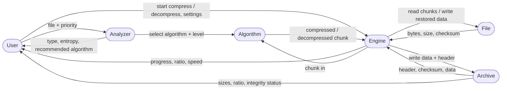

# kolma

A pluggable file-compression engine with an analyser in front of it, a parallel
chunk engine underneath, and a terminal interface on top.

[](https://github.com/LangerSword/kolma/actions/workflows/ci.yml)
[](LICENSE)


`kolma` is a working implementation of a six-entity design: **User, File,
Analyzer, Algorithm, Engine, Archive**. Seven compression methods live behind
one interface, an analyser measures the input before committing to a method, and
the engine splits large files into chunks it compresses in parallel and verifies
on the way back out. Nothing is claimed that the test suite does not exercise:
the primitives are checked against published RFC vectors, every method is
round-tripped over eleven input shapes, and the terminal interface is driven
through a real pseudo-terminal in CI.

```
$ kolma compress /usr/bin/cmake
analysis    : elf, entropy 5.91628 bits/byte. Over a 1048576-byte sample:
              lz77 -> 0.439732, lzw -> 0.509609, huffman -> 0.74306, delta-rle -> 1.88366.
              Best ratio: lz77 (0.439732). Chose lz77 at level 6 for Balanced.

algorithm   : lz77 (LZ77 (LZSS)) at level 6
original    : 11.37 MiB
compressed  : 6.11 MiB
ratio       : 0.5376  (46.2% of the original saved)
throughput  : 39.30 MB/s
elapsed     : 289.719 ms
chunks      : 6 x 2.00 MiB on 16 thread(s)
crc32       : 16bc7172 recorded in the header
encrypted   : no
output      : /usr/bin/cmake.kolma
```

## The six entities

| Entity | What it is | What it carries |
| --- | --- | --- |
| **User** | the person running the program | mode, priority, chosen algorithm, level, password, output location |
| **File** | the input, or the restored output | name, path, size, type, entropy estimate, checksum, modified time |
| **Analyzer** | inspects a file before anything is compressed | sample size, detected type, compressibility score, recommended algorithm |
| **Algorithm** | a pluggable compression method | name, supported types, typical ratio and speed, memory use, block size, dictionary size |
| **Engine** | the core worker | thread count, buffer and chunk size, memory limit, progress, time, throughput, ratio |
| **Archive** | the compressed output and its metadata record | original and compressed size, ratio, algorithm, level, checksum, format version, encrypted flag, created time |

**User** and **Engine** are the active entities. **File** and **Archive** hold
data and report on themselves. **Analyzer** and **Algorithm** are the decision
and processing parts that sit between them.

## How the entities talk to each other



Every arrow in that diagram is a real call path in this codebase. The
`Engine -- "chunk in" --> Algorithm` edge is the hot loop: `OrderedPipeline`
hands chunk *i* to a worker, the worker calls `Algorithm::compress_block`, and
results are consumed strictly in order so a 40 GiB file never needs more than
`threads + 4` chunks of memory.

## Quick start

```sh
git clone https://github.com/LangerSword/kolma
cd kolma

make            # builds the C++ engine and the Go interface
make check      # unit tests, Go integration tests, and a pty-driven TUI test

./build/kolma compress some-file.bin       # auto: the Analyzer picks a method
./build/kolma decompress some-file.bin.kolma
./tui/kolma-tui                            # the terminal interface
```

Requirements: a C++20 compiler, CMake 3.20+, Ninja (or Make), Go 1.24+ for the
interface, and Python 3 only for the pty smoke test.

## The terminal interface

`kolma-tui` is a client, not a reimplementation. It shells out to the engine and
reads the JSON contract the CLI emits, so there is exactly one implementation of
every algorithm and the interface can be replaced without touching it.

```
kolma  browse   /tmp/kolma-smoke
> file binary.bin                                    11.37 MiB
  file cmake.bin                                     11.37 MiB
  arc  cmake.kolma                                    7.07 MiB
  1/7
↑/↓ move · enter open · backspace up · . hidden · r refresh · q quit
```

Selecting a file runs the analyser for real and shows you what it found, along
with the evidence:

```
kolma  inspect   /tmp/kolma-smoke/cmake.bin

analyzer
  size          11.37 MiB
  type          Executable (elf)
  entropy       5.9163 bits/byte
  compressible  56.0%
  recommends    lz77
  sample trials:
    lz77           ratio 0.4397      223.23 ms
    lzw            ratio 0.5096       42.25 ms
    huffman        ratio 0.7431       12.30 ms
    delta-rle      ratio 1.8837        7.88 ms

settings
  algorithm     auto (the Analyzer decides)
  level         auto (from the priority)
  priority      balanced
  threads       auto (hardware concurrency)
  chunk size    auto (from level and memory limit)
  output        /tmp/kolma-smoke/cmake.bin.kolma
  password      (none: the archive will not be encrypted)
```

| key | what it does |
| --- | --- |
| `j` / `k`, arrows | move in the browser |
| `enter` | open a directory, or select a file and analyse it |
| `backspace` | go up a directory |
| `.` | show or hide dotfiles |
| `a` / `A` | cycle the algorithm (`auto` lets the Analyzer choose) |
| `[` / `]` | level, 1 (fastest) to 9 (best ratio), `0` means auto |
| `p` | priority: maxratio, balanced, maxspeed |
| `t` / `T` | worker threads |
| `k` | chunk size |
| `o` / `w` | edit the output path, set a password |
| `c` / `d` | compress, decompress |
| `b` / `i` | benchmark every method, read an archive's header |
| `?` | help |
| `esc` | back one screen |
| `q` | quit |

Compression and decompression run on a worker goroutine and stream progress
into the run screen, which ends on the statistics and the checksum comparison.
The password is passed to the engine through `KOLMA_PASSWORD`, never on a
command line, so it does not appear in `ps`.

## The CLI

```
kolma compress   <file> [options]      # also: c, pack
kolma decompress <archive> [options]   # also: d, unpack, extract
kolma analyze    <file>                # the Analyzer's verdict and its evidence
kolma bench      <file>                # every method against the same input
kolma info       <archive>             # header, sizes, integrity
kolma algos                            # the method registry
kolma version
```

| flag | meaning |
| --- | --- |
| `-a, --algo <id>` | `store`, `rle`, `huffman`, `lz77`, `lzw`, `bwt-mtf-ari`, `delta-rle`, or `auto` |
| `-l, --level <1-9>` | effort; 1 is fastest, 9 is best ratio |
| `-p, --priority <p>` | `maxratio`, `balanced`, `maxspeed` (used when `--algo` is `auto`) |
| `-o, --out <path>` | output path |
| `--password <pw>` | encrypt; visible in `ps`, so prefer `KOLMA_PASSWORD` |
| `-t, --threads <n>` | worker threads, default is hardware concurrency |
| `--chunk-size <s>` | bytes per chunk, accepts `64K` / `4M` suffixes |
| `--memory-limit <s>` | working-set ceiling, default `256M` |
| `--no-verify` | skip the checksum check on decompression |
| `--json` | one progress object per tick on stderr, one result object on stdout |
| `-q, --quiet` | no progress line |

The `--json` mode is the contract the interface depends on, and it is stable:

```console
$ kolma compress corpus.txt --json 2>/dev/null | head -c 200
{"event":"done","ok":true,"stats":{"algorithm":"lz77",...,"verified":true},"analysis":{...}}
```

## Algorithms

| id | method | typical ratio | typical speed | memory | block | dictionary |
| --- | --- | --- | --- | --- | --- | --- |
| `store` | raw passthrough | 1.00 | 3 GB/s | – | – | – |
| `rle` | run-length, count/byte pairs | 0.55 | 300 MB/s | – | 16 MiB | – |
| `huffman` | canonical order-0 prefix codes | 0.66 | 120 MB/s | 1 MiB | 16 MiB | – |
| `lz77` | LZSS, 32 KiB window, lazy above level 4 | 0.28 | 19 MB/s | 8 MiB | 16 MiB | 32 KiB |
| `lzw` | dictionary, 9..12 bit variable codes | 0.43 | 40 MB/s | 2 MiB | 16 MiB | 4096 entries |
| `bwt-mtf-ari` | BWT, move-to-front, order-0 range coder | 0.21 | 7 MB/s | 16 MiB | 256 KiB | – |
| `delta-rle` | delta filter with a measured stride, then RLE | 0.35 | 240 MB/s | 4 MiB | 4 MiB | – |

Ratios and speeds above are measured on a 1.91 MiB corpus of real C headers at
level 6; see [Performance](#performance) for the full table and the machine.

Three details that matter more than the table:

- **Per-chunk fallback.** If a method makes a chunk bigger, the chunk is stored
  raw and flagged. `rle`, `delta-rle` and `store` therefore report a ratio of
  exactly 1.0000 on data they cannot help, instead of quietly adding overhead.
- **The Analyzer's veto.** Already entropy-coded input (jpeg, png, mp4, zip, …)
  is flagged before any method runs, because a second pass can only add framing.
- **Block size is a property of the method, not a global.** `bwt-mtf-ari` caps
  its blocks at 256 KiB because the suffix sort is superlinear in time, so a
  11 MiB file becomes 46 chunks rather than 6. The engine honours that.

## Archive format

One self-describing container, little-endian throughout:

```
magic "KOLMA" | version u16 | algorithm u8 | level u8 | file type u8 | flags u8
orig_size u64 | comp_size u64 | orig_crc u32 | created u64
chunk_size u64 | chunk_count u32 | kdf_iterations u32
salt[16] | nonce[12]
name_len u16 | name | detail_len u16 | detail
chunk_count x { orig_size u64 | comp_size u64 | flags u8 }
payload_crc u32
payload: the compressed chunks, concatenated in order
```

Every chunk is independently decodable, which is what makes parallel
compression and bounded memory possible. Chunk flag bit 0 marks a chunk stored
raw, so a single archive can mix a method with passthrough blocks.

The header is written twice: once as a placeholder so the payload can stream
straight to disk, then rewritten in place once the real sizes, checksums and
chunk table are known. Header length does not depend on any of those values,
which is why the rewrite is safe.

## Encryption

`--password` (or `KOLMA_PASSWORD`) encrypts the payload with **ChaCha20** under a
key derived by **PBKDF2-HMAC-SHA256** with a 16-byte random salt and 200 000
iterations. Each chunk uses the header nonce with its index in the last four
bytes, so no two chunks share a keystream. The `Encrypted` flag and the KDF
parameters live in the header; the password is never stored or logged.

The primitives are verified against published vectors — SHA-256 and HMAC against
FIPS 180-4 and RFC 4231, PBKDF2 against RFC 7918/7914 vectors, ChaCha20 against
the RFC 8439 §2.4.2 sunscreen ciphertext. That is the limit of the claim: this is
a from-scratch implementation, **not audited**, and there is no authentication
tag, so it protects data at rest from casual inspection and nothing more. Use
age or GPG for anything that matters.

## Design notes

**Why C++ for the engine.** The work is byte-level and allocation-sensitive:
sliding windows, hash chains, bit-level coders, suffix arrays, a range coder
that must wrap in exactly 32 bits. C++20 gives `std::span` for zero-copy
slicing, `std::thread` for the chunk pipeline, and no runtime between the hot
loop and the data.

**Why Go for the interface.** It is a client process with asynchronous work to
coordinate — a subprocess to drive, progress to stream, a file browser, three
editable fields — and Go's concurrency and standard library make that boring in
the best way. It is also a language this repository's author had never shipped,
which was half the point.

**Why the JSON contract instead of cgo.** A shared library would have meant
marshalling across an FFI boundary for every progress tick. A subprocess with a
line-oriented protocol is trivially testable from any language, keeps the engine
authoritative, and means the Go tests are genuine integration tests rather than
mock exercises.

A [`flake.nix`](flake.nix) is included for reproducible builds. It has not been
exercised — Nix was not installed on the machine where this was written — so
treat it as a starting point; the CMake and Go builds are the tested paths.

## Testing

```sh
make test        # 51 C++ tests
make tui-test    # 22 Go tests, driving the real engine binary
make smoke       # drives the TUI through a pty and asserts on the frames
make check       # all three
```

What the C++ suite covers:

- **Published vectors.** CRC-32 (IEEE), SHA-256 (FIPS), HMAC-SHA256 (RFC 4231),
  PBKDF2-HMAC-SHA256 (RFC 7914), ChaCha20 (RFC 8439 §2.4.2). A round-trip with
  itself proves nothing; these prove the primitives are the real thing.
- **Round-trips.** Every method over eleven fixtures — empty, one byte,
  `"banana"`, flat runs, text-like, repetitive, smooth numeric, uniform random,
  and a prime-sized 100 003-byte input — at levels 1, 6 and 9. LZW gets two
  300 KB inputs specifically to cross the 9→10→11→12 bit width transitions and at
  least one dictionary reset.
- **Corruption.** A flipped bit in any method's block must either throw or change
  the output; a truncated block must be rejected. Silence is a failure.
- **Level monotonicity.** Level 9 may never compress worse than level 6, and
  level 6 may never lose to level 3. This is a regression guard: lazy matching
  used to insert a position into its hash chain twice, which put the position in
  its own chain and made level 6 *worse* than level 3.
- **Engine behaviour.** Parallelism does not change the result (1, 4 and 8
  threads produce identical output), many small chunks round-trip, encryption
  round-trips and rejects a wrong password, damaged archives fail verification,
  the engine refuses to overwrite its own input, and progress callbacks are
  monotonic.
- **Analyzer behaviour.** Magic bytes beat extensions, the veto fires on
  entropy-coded formats and on uniform random data, and recommendations match
  the priority.

The Go suite drives the built binary: it compresses, watches progress events
arrive in order, decompresses, and compares the bytes. The UI tests exercise the
same `Update` path the program uses, including key handling, bounds, stale
message rejection and rendering of every screen. `scripts/tui_smoke.py` runs the
real binary under a pseudo-terminal, answers its terminal capability queries,
sends keystrokes, and asserts on the rendered frames — including that pressing
`c` actually writes an archive to disk.

## Performance

Measured on an AMD Ryzen 7 260 (16 hardware threads, 14 GiB RAM), GCC 16.2.1,
`-O3`, level 6.

**1.91 MiB of real C headers**, each method using its own preferred block size:

| method | ratio | output | throughput |
| --- | --- | --- | --- |
| `bwt-mtf-ari` | **0.2124** | 414.83 KiB | 7.31 MB/s |
| `lz77` | 0.2793 | 545.61 KiB | 19.02 MB/s |
| `lzw` | 0.4295 | 838.79 KiB | 39.72 MB/s |
| `huffman` | 0.6561 | 1.25 MiB | 123.90 MB/s |
| `store` | 1.0000 | 1.91 MiB | 4.61 GB/s |

**2.00 MiB of a real ELF binary**:

| method | ratio | output | throughput |
| --- | --- | --- | --- |
| `bwt-mtf-ari` | **0.3993** | 817.72 KiB | 6.07 MB/s |
| `lz77` | 0.4735 | 969.73 KiB | 8.86 MB/s |
| `lzw` | 0.5478 | 1.10 MiB | 34.15 MB/s |
| `huffman` | 0.7648 | 1.53 MiB | 108.46 MB/s |

**1.91 MiB of uniform random data**: every method reports 1.0000. The per-chunk
fallback stores the input unchanged rather than growing it.

**The whole 11.37 MiB ELF through the engine**, default chunking, 16 threads:

| method | ratio | throughput | chunks |
| --- | --- | --- | --- |
| `bwt-mtf-ari` | 0.4365 | 4.12 MB/s | 46 x 256 KiB |
| `lz77` | 0.5376 | 39.30 MB/s | 6 x 2 MiB |
| `lzw` | 0.6219 | 89.53 MB/s | 6 x 2 MiB |
| `huffman` | 0.7812 | 153.95 MB/s | 6 x 2 MiB |

**Level is a real trade-off, not a knob that does nothing** (`lz77`, 1.91 MiB of
text, default chunking):

| level | ratio | throughput |
| --- | --- | --- |
| 1 | 0.3172 | 197.54 MB/s |
| 3 | 0.2989 | 139.92 MB/s |
| 6 | 0.2793 | 16.95 MB/s |
| 9 | 0.2789 | 15.48 MB/s |

Eleven times the speed for twelve points of ratio. `balanced` sits at level 6
because that is where the curve flattens; `maxspeed` picks level 1 and prefers a
method within 15% of the best ratio if it is faster.

## Repository layout

```
core/include/kolma/     public headers: util, bitio, file, algorithm, analyzer, archive, engine
core/src/               the entities; src/algorithms/ holds one file per method
cli/main.cpp            the command line front end and the JSON contract
tui/                    the Go interface (main.go, internal/core, internal/ui)
tests/                  the C++ suite and its fixtures
scripts/tui_smoke.py    pty-driven interface test
docs/                   the design notes this project was built from
.github/workflows/ci.yml  build, tests, sanitizers
flake.nix               reproducible build definition (see the note above)
```

## Limitations

- **No authentication.** Encryption has no MAC, so a modified archive is detected
  by the CRC-32 of the restored data but not before decryption. It is not
  tamper-proof.
- **`bwt-mtf-ari` is slow** and its block size is capped at 256 KiB for that
  reason. A parallel suffix-array construction would lift the cap.
- **The benchmark uses each method's preferred block size**, so on small inputs
  wide-block methods are measured single-threaded. That is honest per-method
  speed, not engine throughput; the 11.37 MiB table above is the engine number.
- **POSIX only.** The engine uses `pread` for lock-free parallel reads, so it
  targets Linux and macOS rather than Windows.
- **Level 9 buys almost nothing over level 6** on the corpus measured here. It is
  kept because the design calls for nine levels and it does help on other inputs,
  but the honest advice is to use level 3 or 6.

## License

MIT. See [LICENSE](LICENSE).